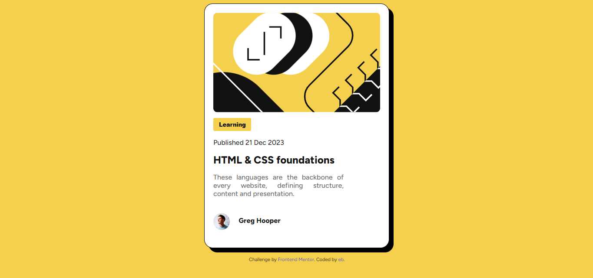

# Frontend Mentor - Blog preview card solution

This is a solution to the [Blog preview card challenge on Frontend Mentor](https://www.frontendmentor.io/challenges/blog-preview-card-ckPaj01IcS). Frontend Mentor challenges help you improve your coding skills by building realistic projects. 

## Table of contents

- [Overview](#overview)
  - [The challenge](#the-challenge)
  - [Screenshot](#screenshot)
  - [Links](#links)
- [My process](#my-process)
  - [Built with](#built-with)
  - [What I learned](#what-i-learned)
  - [Continued development](#continued-development)
- [Author](#author)

## Overview

### The challenge

Users should be able to:

- See hover and focus states for all interactive elements on the page

### Screenshot



### Links

- Solution URL: [Add solution URL here](https://your-solution-url.com)
- Live Site URL: [Add live site URL here](https://your-live-site-url.com)

## My process

### Built with

- Semantic HTML5 markup
- CSS

### What I learned

I have learned a lot abbout how to centralize objects and make a responsive website. Furthermore, i felt free to try out some css codes that i learned in my free time, like the one below.

```html
<button class="category">Learning</button>
```
```css
.category {
    background-color: hsl(47, 88%, 63%);

    border-radius: 3px;
    padding: 0.5em 1em;
    border-width: 0px;

    font-weight: 800;
    margin: auto;
    margin-bottom: 0.5em;
    margin-top: 1em;
    font-size: 0.8em;

    transition: transform 0.3s;
}

.category:hover {
    transform: translateY(-5px);
}
```

### Continued development

I had a lot of difficulty adjusting the author's name to his image so that it was centered. I believe this is something I want to focus on in future projects, as it took a long time and gave me a lot of headaches.

**Note: Delete this note and replace the list above with resources that helped you during the challenge. These could come in handy for anyone viewing your solution or for yourself when you look back on this project in the future.**

## Author

- Frontend Mentor - [@enderbone](https://www.frontendmentor.io/profile/enderbone)
- Twitter - [@anledruis](https://www.twitter.com/anledruis)

