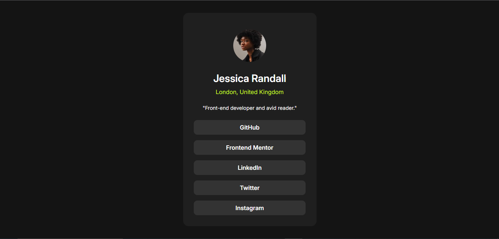
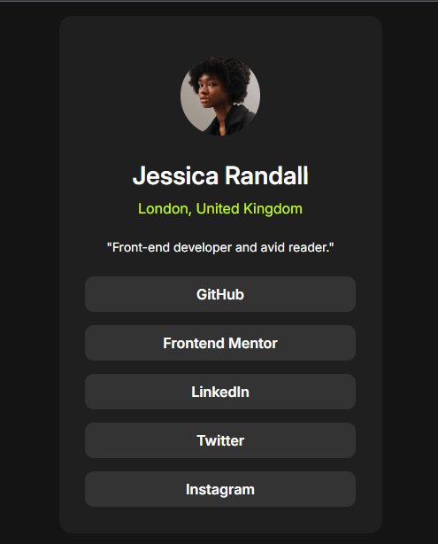

# Frontend Mentor - Social links profile solution

This is a solution to the [Social links profile challenge on Frontend Mentor](https://www.frontendmentor.io/challenges/social-links-profile-UG32l9m6dQ). Frontend Mentor challenges help you improve your coding skills by building realistic projects. 

## Table of contents

- [Overview](#overview)
  - [The challenge](#the-challenge)
  - [Screenshot](#screenshot)
  - [Links](#links)
- [My process](#my-process)
  - [Built with](#built-with)
  - [What I learned](#what-i-learned)
  - [Continued development](#continued-development)
  - [Useful resources](#useful-resources)
- [Author](#author)


## Overview

### The challenge

Users should be able to:

- See hover and focus states for all interactive elements on the page

### Screenshot




### Links

- Solution URL: (https://github.com/enderbone/frontend-mentor/tree/main/social-links-profile-main)
- Live Site URL: (https://social-links-profile-main-enderbones-projects.vercel.app/)

## My process

### Built with

- Semantic HTML5 markup
- Flexbox


### What I learned

Learned a little bit of how to use flexbox to centralize divs on my site. This save me a lot of time and make my work much easier. Additionally, I also learned how to better work on responsiveness using the "vh" unit.

```css
body {
    display: flex;
    flex-direction: column;
    justify-content: center;
    align-items: center;

    min-height: 100vh;
}
```

### Continued development

Want to focus on my flexbox learning. This proved to be a powerful resource and i think it is a great ally on my futures css codes.

### Useful resources

- (https://www.youtube.com/watch?v=wsTv9y931o8&t=418s&pp=ygUHZmxleGJveA%3D%3D) - This helped to understand a lot abount flexbox.

## Author

- Frontend Mentor - [@enderbone](https://www.frontendmentor.io/profile/enderbone)
- Twitter - [@enderbone](https://github.com/enderbone)
